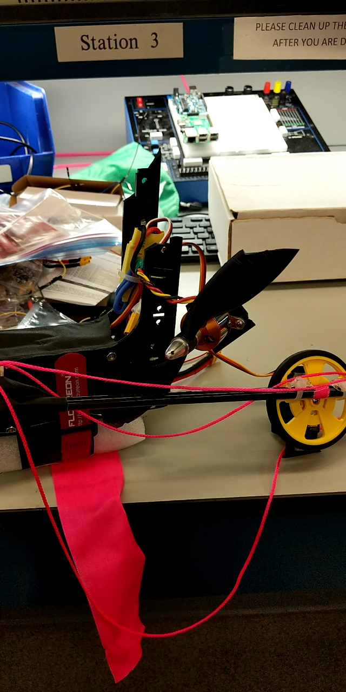
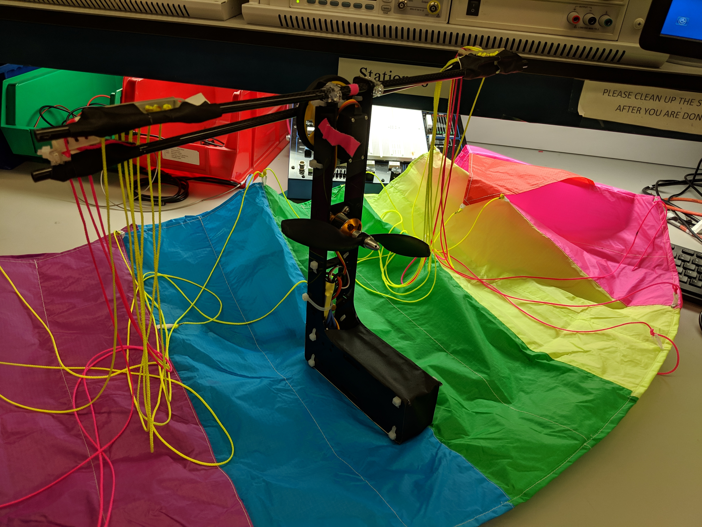
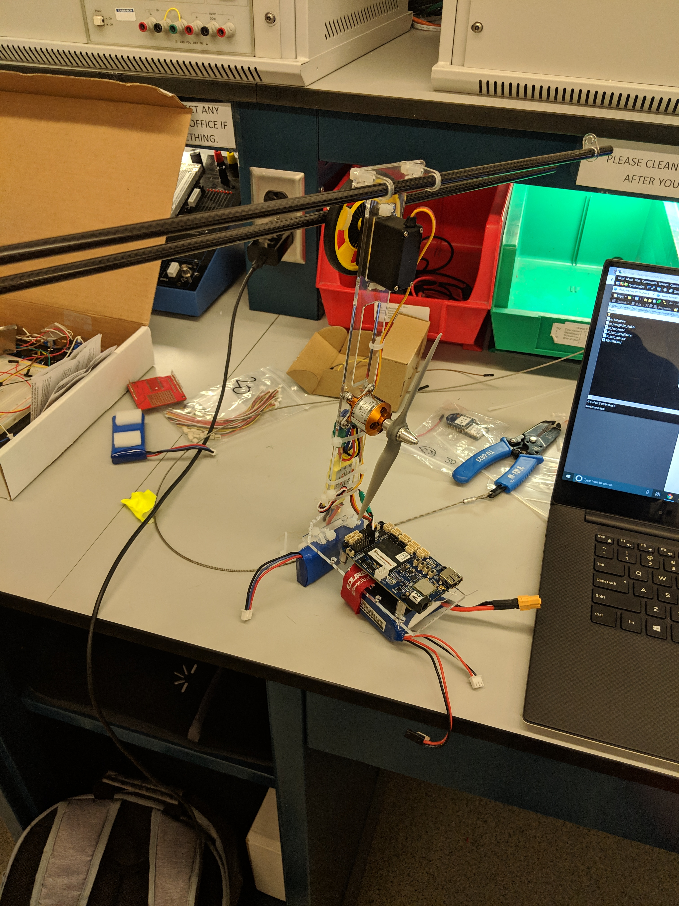
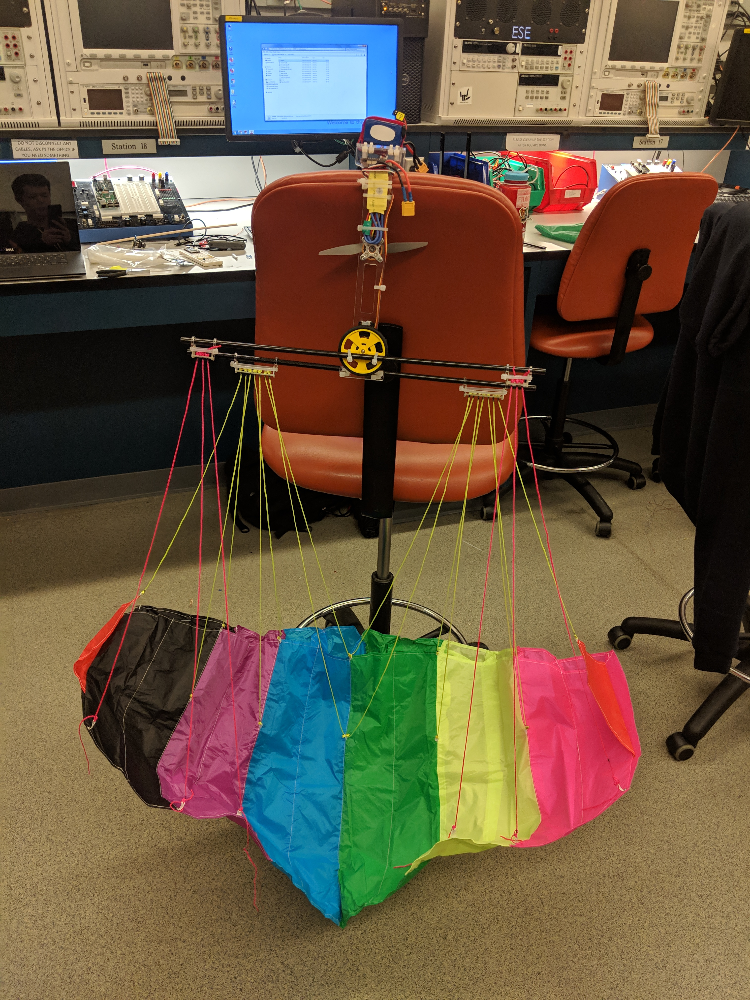
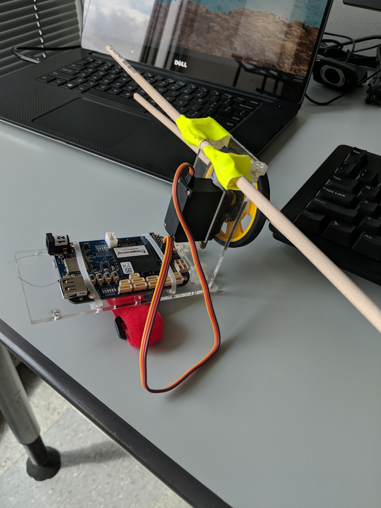

## 5/1/19 : Changes for Reach Demo Day

## 4/28/19 : Lessons From Baseline Demo Day
Overall our baseline demo was a success, especially after the few good flights we got in yesterday.  The following are our areas of improvement before the reach demo, ranked in importance:

1. Remake parts of the paraglider body out of MDF so it is less brittle.
2. Introduce steering controls over wifi with an ESP32 based controller.
3. Tune the parachute and fix stabilization so the paraglider flies straight.
4. Introduce some landing sequence so landing can be done without crashing.
5. Reduce weight/keep weight low. 

## 4/27/19 : Testing
We started out the day by flying the paraglider outside of Towne.  Shortly after taking off it make a sharp turn right and hit Towne at full speed, shattering the acrylic frame.  Fortunately, none of the electronics were damaged.

We laser cut a new frame out of acrylic which is almost identical to prototype 3.  We then tested the new frame further away from a building.  In this test the motor power was too high (85%), causing the paraglider to tilt back and stall.

Prototype 3 Successful Flight #2:

The frame broke in that flight as well, but only into a few pieces allowing us to glue it back together for more tests.  This next test we had the power too low (65%), but it flew pretty straight.

Prototype 3 Successful Flight #3:

For the next flight we increased the motor power to 75%, getting us pretty close to the optimal amount of thrust.  This was by far our most successful flight yet in terms of distance and time in the air.  It tended to steer left and the servo was unable to compensate for this, but we think this can be fixed by loosening the strings on the left side of the paraglider slightly.  As a result of our lack of steering control, the paraglider ended up getting stuck in a tree and had to be retrieved by a helpful observer.

Prototype 3 Successful Flight #4:

Photo of the Paraglider Stuck in a Tree:

Retrieving the Paraglider:

## 4/26/19 : Prototype 3
Today we finished making prototype 3, which is much stiffer and provides drastically more thrust than prototype 2.

Prototype 3:

Video of Increased Thrust:

We also had our first successful flight so far, but crashed into the sidewalk.  It was scratched but luckily nothing broke.

Successful Flight Video:

## 4/17/19 : Prototype 2
We updated our prototype 1 design to accomidate a 6 inch propeller for thrust and switched to the much stiffer carbon fiber rods.  It functioned better than prototype 1, but it became clear that we do not have enough thrust.  We decided that for prototype 3 we will switch to 8 inch propellors and a 3s battery rather than a 2s battery.  These changes should give use 5-6 times as much thrust.  We also decided that the way we attached the acrylic at a 90 degree angle is not strong enough, so we will be changing this as well for the next version.

Prototype 2:

Prototype 2 With Parachute:

## 4/13/19 : Prototype 1
Over the past few days we designed and lasercut our first prototype paraglider gondola.  We also started working on PID stabilization and tested the paraglider.  The big takeaway from this week is that the paraglider absolutely has to be powered to fly for more than 1-2 seconds.  Researching further, paragliders utilize a ram aerofoil which require constant power to inflate an provide lift.  We will now be adding the propeller as part of our baseline goals rather than as a reach goal.

Prototype 1:

Video of Laser Cutting:

Video of Prototype 1 Test Flight:

## 4/8/19 : Beginning of Development
We began development on the BeagleBone Blue and learned how to read values from the gyro to control a servo.

Video:

